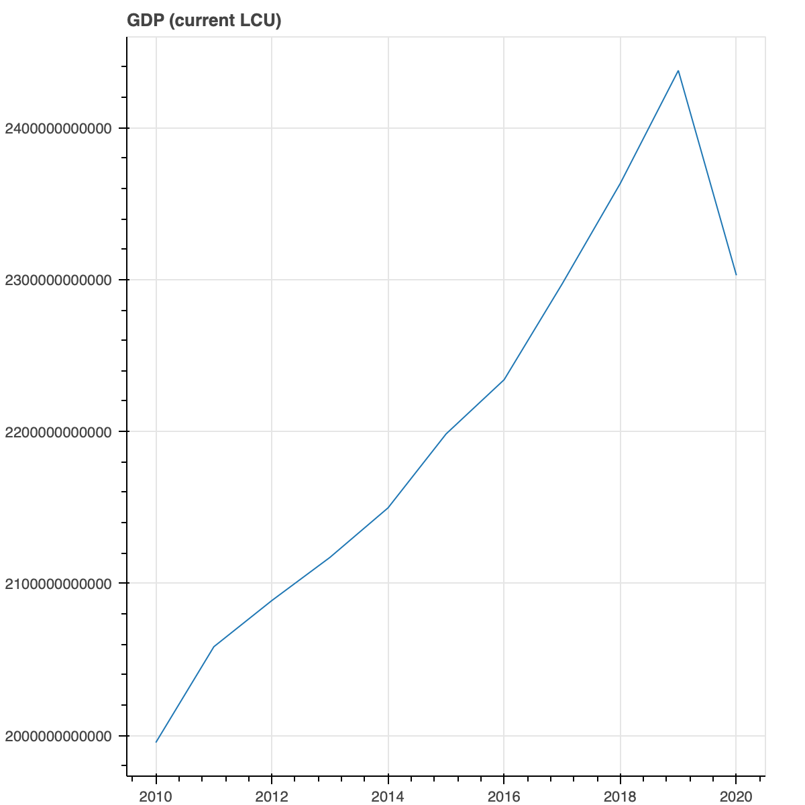

# freconomyanalysis
This is part of a paper for an international economics class at Kettering University

I chose to focus on the French economy in 2010 and 2019, looking at different aspects such as exports and imports, export and import markets, as well as different metrics between the time frame.

To create the graphics and analytics used for the paper, I created a Python script to load data from [WITS.WorldBank.org](https://wits.worldbank.org) and [data.WorldBank.ord](https://data.worldbank.org/) then create visuals and produce analytics from the data.

Factors considered in paper:
- Exports
- Export markets
- Imports
- Import markets
- GDP (current US$)
- GDP (current LCU)
- GDP growth (annual %)
- GDP per capita (current LCU)
- GDP per capita (current international $)
- Population total
- Population density (people per sq. km of land area)
- School enrollment, primary (% net)
- School enrollment, secondary (% net)
- Real effective exchange rate index (2010 = 100)

For exports, export markets, imports, and import markets, data used was for both 2010 and 2019. 
For the remaining factors, data was used between 2010 and 2019 inclusively.

***

Creating a Python script as opposed to using graphics from WorldBank.org was a great learning experience and allowed much more detailed analysis with direct access to the data.

Improvements could be made to include filters to show or hide different factors on the same graph to compare.

***

Figures used in paper

	
	
	
	
	

	
	
	
	
	

Tables used

	
	
	
	
	

	
	
	
	
	

***

Skills used/learned:
- Microsoft Office
- Python
- Pandas
- Bokeh
- Reading CSV
- Creating interactive figures
- Analyzing data using Pandas

***

A copy of the paper associated with this project may be shared upon request. Email me at jcl@ltgi.net

**Disclaimer**: 
No license is associated with this project by design as this project is to be used for display and education of how the code works only.
